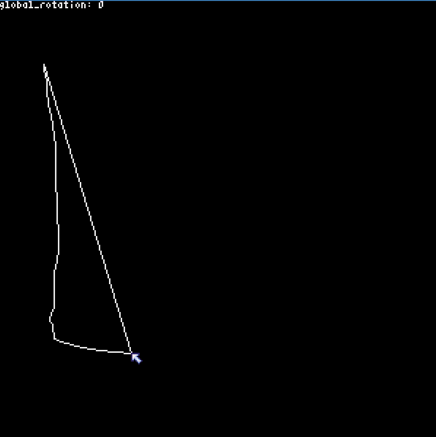
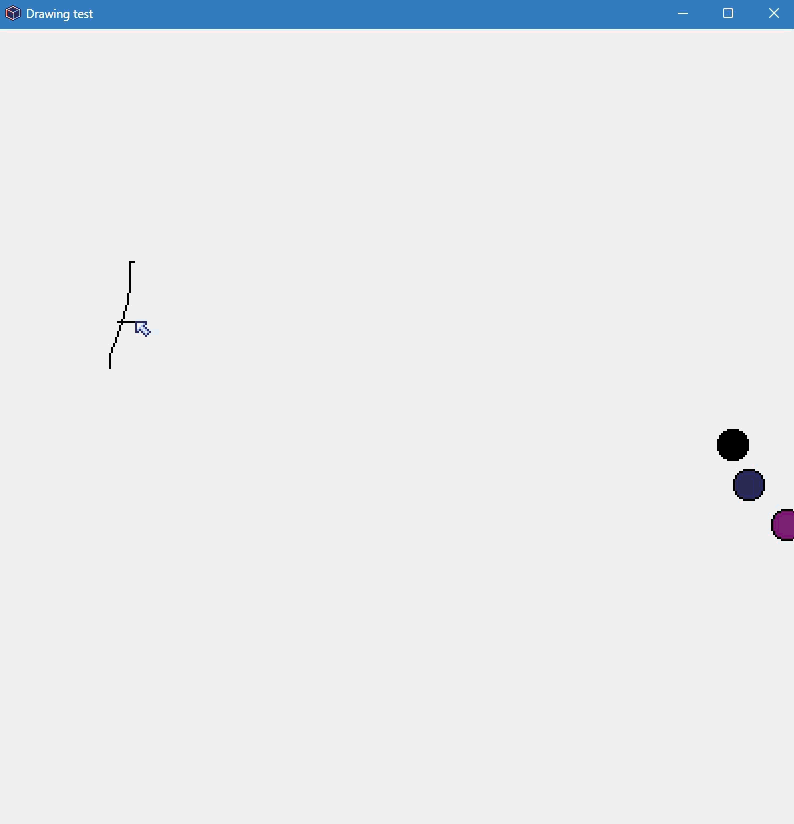
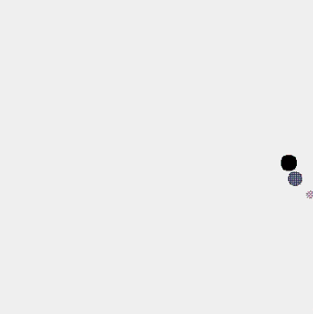
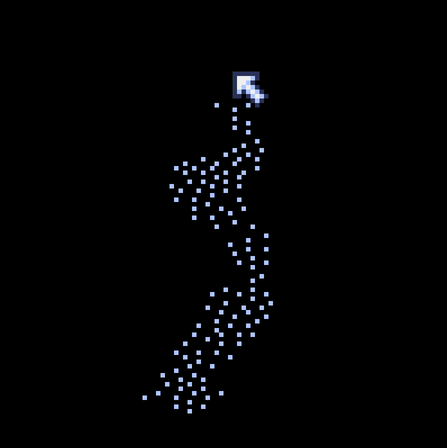
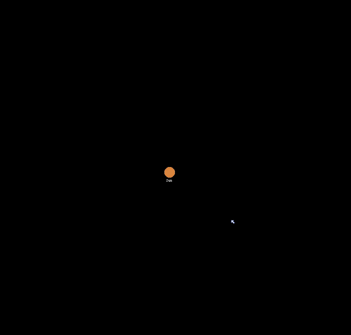

# Little Projects
## This a compilation of little projects I make for fun.
### Why ?
- Just a bit bored and I find the mechanic behind each project interesting

### Code is so bad !
- Yeah I know I only did 1 year of real python (the rest is just me doing random stuff), I'm not at all a master and some parts of code are more than just weird.

### GIFs ARE LAGGY ?!
- They are originally from a discord discussion with one of my friends but because of the upload limit, I had to reduce the quality and frame rate for each one.

### Overview of each project:

#### 3dDrawing:

A fake 3d drawing, there is one axis or rotation (Y)
Controls:
- Left and right arrow key: rotate left and right
- Left mouse button: draw
And yeah that's it, a bit anti-climactic ...

#### blackhole:
There is absolutely nothing in this, I just use it as a quick template when making another project to go faster

#### drawing:

Simple 2d drawing program
Controls:
- Z: remove last stroke
- S: remove last point and if last point in stroke also the stroke
- UP / DOWN arrows: change colors (you can see current color at the right)

- How to change width ?: You cannot, keyword here: "flemme"

#### fluidism bit broken

As said in the title it's a fluid sim, but I had a bit too much "flemme" (yes again) to make them use velocity, so it just repels based on proximity and has gravity
Controls:
- Left mouse: put some particles, (don't use it too much, after 3 clicks it's already laggy)

#### gravity shape

ehhh Idk how to really explain this one, I just like it, can be very interesting to tweak the formulas to see different effects as well as other variables for a lot of different effects!
Controls:
- Left mouse: place a point (if a point is near another one it will "connect" to it, they will also attract and repel to each other to a certain level (this can be changed))

#### mountain
creates a shape similar to a mountain range seen from the top and yeah that's it... (and no controls)

#### raycasting
A simple ray casting engine, Idk why but when too close to a wall, it digs in it, and there is no collision, so you can ... explore ... haha (totally not "flemme")
Controls:
UP/DOWN key: go forward/backward
LEFT/RIGHT: rotate left/right the camera

#### ripples

Creates the same effect as throwing a rock, but there is no oscillation ? Well see it as adding water or removing some (very mesmerizing) !(if you add or remove too much water all the water (dots) can disappear)
Controls:
- LEFT/RIGHT click: add/remove water

#### space

A sim for planets and gravitation (the "sun" is centered in the middle but commenting one line and he'll move again, if you want to)
Controls:
LEFT/RIGHT key: control next planet size (size can go up/down very quick !!!)
Drag left click: gives velocity and creates the new planet
